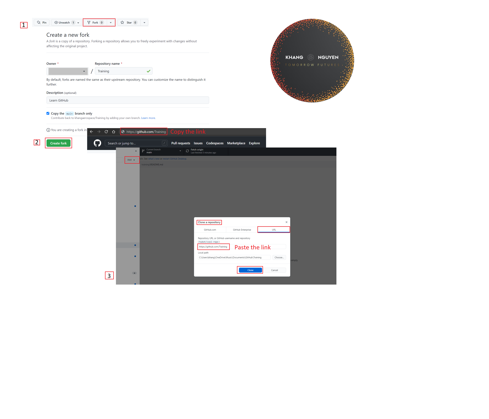
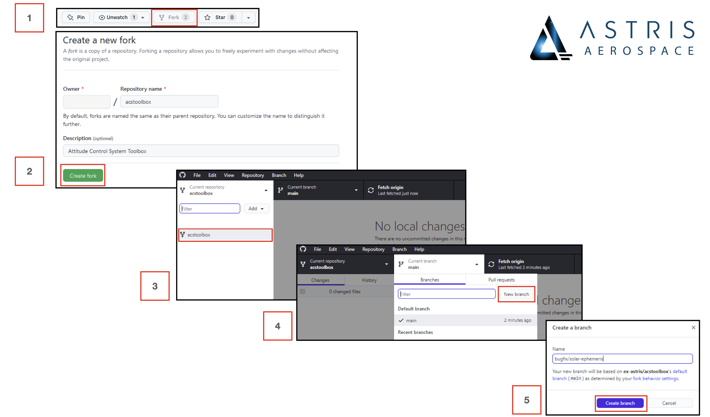
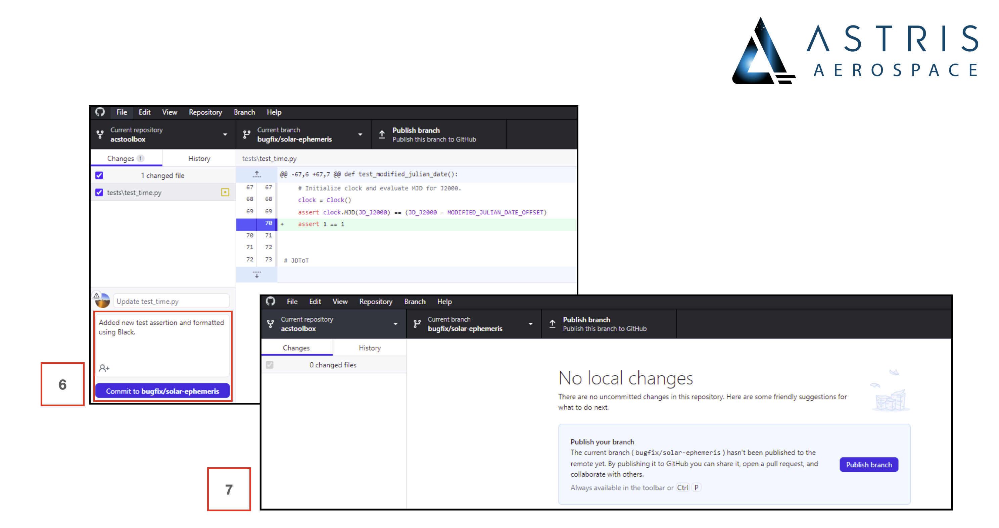
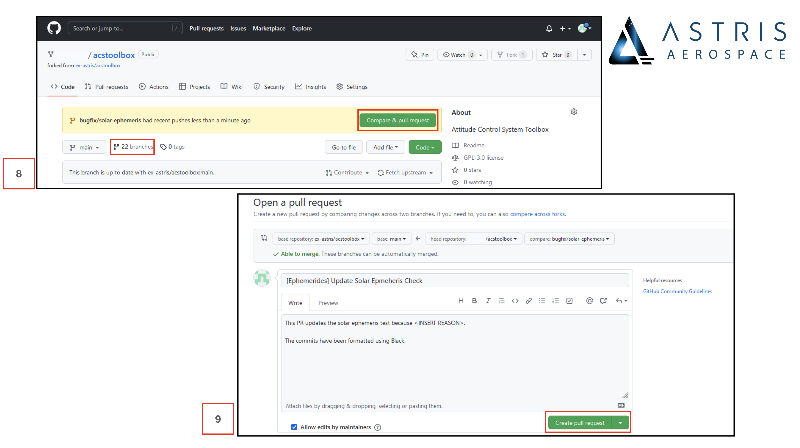

## Table of contents
- [Table of contents](#table-of-contents)
- [Ways To Contribute](#ways-to-contribute)
  - [Report Bugs and Provide Suggestions](#report-bugs-and-provide-suggestions)
  - [Contribute Bug Fixes and New Features](#contribute-bug-fixes-and-new-features)
- [Contributing Using Pull Requests](#contributing-using-pull-requests)
  - [Fork, Branch, Edit and Push](#fork-branch-edit-and-push)

## Ways To Contribute

### Report Bugs and Provide Suggestions

Unit tests are implemented ubiquitously. However, new use cases have the possibility of breaking certain utilities.
If you have suggestions for improvement or find something that doesn't work as intended, please open a new ticket in the issue tracker.

### Contribute Bug Fixes and New Features

If you have already implemented suggested improvements or made fixes to encountered bugs, please contribute your code by pushing a pull request (PR) to the respository.
One of the developers will review your code, suggest feedback and merge it into the codebase if possible.
See below on how to open a new PR.

<!--TODO: Add Documentation Contributions + TOC-->

## Contributing Using Pull Requests

The best way to improve and expand a Github libary is to push PRs to the repository which will be checked and merged by one of our developers. 
GitHub allows you to make minor source code changes and push a PR directly from your browser and without additional software.
The online [Introduction to Github](https://docs.github.com/en/get-started) demonstrates how to do this.
For more complex code changes, please fork the codebase and push a new branch to the libary respository.
This can either be done on the command line interface (CLI) by experienced developers or on the [desktop Github application].
Only the latter is outlined below.

<!--Insert CLI instructions-->

### Fork, Branch, Edit and Push

The following steps outline how to push a new PR toa Github libary repository for review and approval. 
Your system will require the [desktop Github application](https://desktop.github.com/) to be installed on your machine and a consistent internet connection.

1. Fork a libary repository from your browser while logged into your Github account.
2. Give the forked repository a name and description and click `Create fork` in your browser.
3. Copy the link from the forked repository and clone that repository to your desktop application

    

   
4. In the Github desktop application, select the forked repository under the `Current repository` dropdown menu to perform a local checkout.

5. In the desktop application, select `New branch` under the `Current branch` dropdown menu.
6. Give your branch an appropriate name and click `Create branch`.

    

6. Code your feature/bug fix and in the Github desktop application, commit your code to your branch while providing an appropriate description.
7. In the desktop application, select `Publish branch` to push your new code to your online repository

    

8. In your browser, find the branch you just uploaded and select `Compare & pull request` to start a new PR. 
9. Enter a PR title and detailed description. Provide motivation, any references and results. Select `Create pull request` to initiate the continuous integration (CI) pipeline.

    

10. Code maintainers will automatically be selected as reviewers and unit tests will be run as part of CI.
If a single test fails, select `Details` to understand why and push an updated commit to the PR.

    

